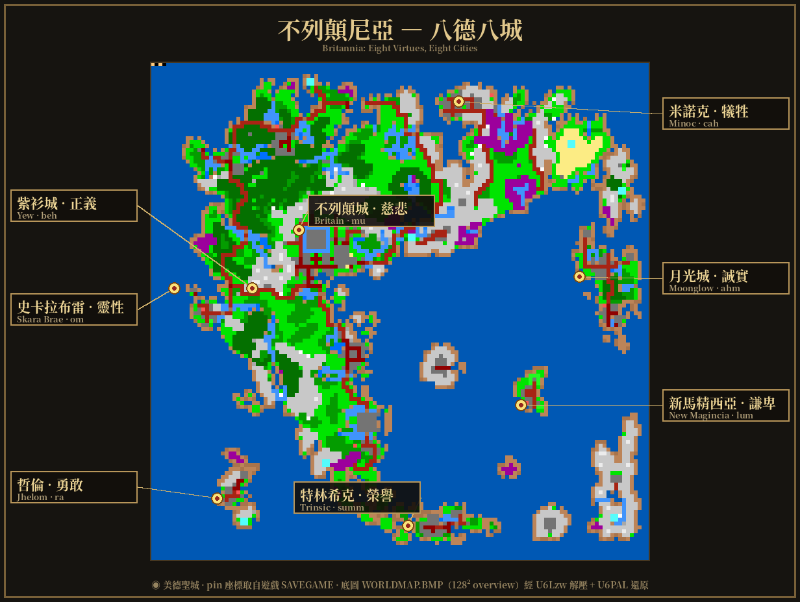
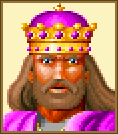
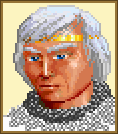
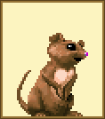
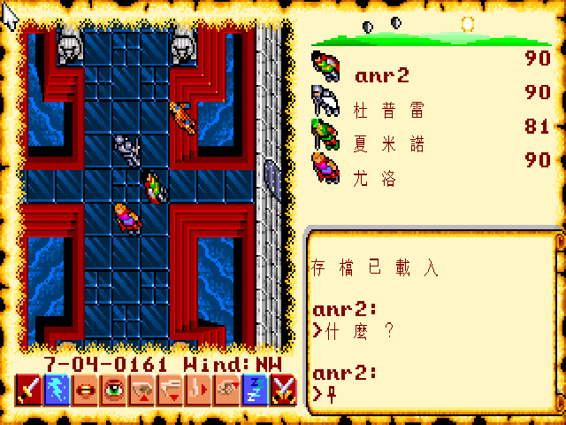

# Ultima VI 繁體中文化專案

> *Ultima VI: The False Prophet* (1990 Origin Systems) — 完整繁體中文化  
> 199 NPC + BOOK.DAT + 開場 cinematic 全翻譯 ✦ ScummVM Nuvie engine ✦ AR PL UMing 11px Big5 字型

---

## 目錄

1. [一句話說清楚（Hero Section）](#hero)
2. [快速開始（Quick Start）](#quick-start)
3. [為何要漢化 U6？](#why)
4. [黑暗三紀 — Ultima 系列大歷史](#dark-ages)
5. [八德代數美 — 2³ 的設計哲學](#virtues)
6. [Ankh 的故事 — 一個符號橫跨三千年](#ankh)
7. [Lingua Magica — 26 個魔法音節構成的語言](#lingua-magica)
8. [Britannia 世界 — 八德八城](#britannia)
9. [實機截圖展示](#screenshots)
10. [1992 台灣中文化先行者](#pioneers-1992)
11. [Technical Deep Dive](#technical-deep-dive)
12. [License & Credits](#credits)

---

<a name="hero"></a>
## 🏰 Ultima VI 繁體中文版 — 以母語走進 Britannia


*「汝之世界已歷五載春秋，自汝凱旋歸自不列顛尼亞。」— Ultima VI 開場字幕，以繁體中文呈現*

這是 **Ultima VI: The False Prophet（1990）** 的完整繁體中文化版本。

> 今年剛過 45，也算正式走到中年了。  
> 人生總該做點事情留下紀念。  
>  
> 希望這些中文翻譯，能讓後來的人更容易認識那些經典 RPG，知道它們曾經有多迷人。

| 項目 | 狀態 |
|------|------|
| NPC 對話翻譯 | **199 / 199** 全完成 |
| BOOK.DAT 書卷 | 127 條（1897 字串） |
| 開場 Cinematic | 全 27 個 Lua chunk 中文字幕 |
| 平台 | ScummVM（Linux / Win / Mac / Web / RetroArch） |
| 字型 | AR PL UMing 11px Big5 點陣嵌入式 |
| GitHub | [wicanr2/u6-cht](https://github.com/wicanr2/u6-cht) |

---

<a name="quick-start"></a>
## ⚡ 快速開始

### 你需要準備

- **ScummVM**（含 Nuvie engine 的自訂 build，見 [Release](https://github.com/wicanr2/u6-cht/releases)）
- **Ultima VI 原版遊戲資料**（自行取得合法拷貝）
- **`cht_strings.tab`**（繁中字串表，本 repo 附帶）
- **`big5_u6_12x12.fnt`**（Big5 字型，本 repo 附帶）

### 三步啟動

```bash
# 1. 取得本 repo
git clone https://github.com/wicanr2/u6-cht.git

# 2. 複製字型與字串表到遊戲目錄
cp working/game/cht_strings.tab  /path/to/ultima6/
cp working/game/big5_u6_12x12.fnt /path/to/ultima6/

# 3. 啟動 ScummVM
./scummvm --extrapath=dists/engine-data ultima6
```

啟動後你會看到——


*不列顛王王宮 throne room — 隊員「壯普雷／夏米諾／尤洛」聖者之書譯名同步，介面與命令全中文化。*

---

<a name="why"></a>
## ✨ 為何要漢化 Ultima VI？

1990 年，美國 Origin Systems 推出 *Ultima VI: The False Prophet*。這不只是一款 RPG，而是電玩史上第一次有遊戲用「敵人的文明視角」質問玩家的道德立場。

1992 年，台灣電腦玩家雜誌出版《創世紀聖者之書特別版》（83 頁），軟體世界發行《創世紀６遊戲手冊》（13 頁）。那個年代沒有攻略 App、沒有 Twitch、沒有 Discord；台灣的第一批 Ultima 玩家就憑這兩本薄薄的中文文件，走進一個幾乎全英文的 Britannia 世界。

**三十年後，這個專案想做的事很簡單**：讓 2026 年的中文玩家，能以母語讀到 Iolo 的一聲「汝便是聖者？」、不列顛王的「卿此番辛苦了」，以及魔像族那句充滿尊嚴的「願爾族與本族永守和平」。

> *「見汝甚悅，友也。或汝有閒一聽古事？」*
> — 「'Tis good to see thee, friend. Mayhap thou hast time for a tale?」

---

<a name="dark-ages"></a>
## 📜 黑暗三紀 — Ultima 系列的歷史脈絡

Ultima 系列分三個時代，理解脈絡才能感受 U6 的重量。

### 第一紀：黑暗三紀（Ultima I–III, 1980–1983）

三個魔王、三場征途。玩家扮演「異世界來客 (Stranger)」，幫助 Lord British 打敗：

| 作品 | 反派 | 主題 |
|------|------|------|
| Ultima I (1981) | **蒙丹 (Mondain)** | 擊碎不死寶石 |
| Ultima II (1982) | **米娜克斯 (Minax)** | 時空旅行追緝 |
| Ultima III (1983) | **米索 (Exodus)** | 對抗半人半機器神祇 |

這三紀的主題是傳統英雄史詩：「**找到壞人，打倒他，世界得救**」。

### 第二紀：Avatar 的誕生（Ultima IV–VI）

1985 年，Garriott 做了 RPG 史上最大的設計革命：**取消反派**。

Ultima IV 沒有主線魔王。目標不是「打敗誰」，而是「**成為 Avatar**」——在真理、愛、勇氣三原則下修練八大美德，走遍八座聖壇，成為道德的化身。這是電玩史上第一次把「玩家自身行為的道德性」當作核心機制。

Ultima V–VI 則更進一步：**「美德」本身被扭曲、被質疑、被翻轉**。

| 作品 | Avatar 的處境 |
|------|------|
| Ultima IV (1985) | **成聖之旅**。從 Stranger 升華為 Avatar，RPG 史上首次以道德修為為核心 |
| Ultima V (1988) | LB 失蹤，攝政 Blackthorn 把八德扭曲成暴政律法（「不誠實者處死」）。Avatar 回 Britannia 推翻 Shadowlords |
| **Ultima VI (1990)** | **本作**。魔像族從紅色月之門現身攻擊 Britannia。Avatar 第三次返回，最終發現：**自己才是魔像族眼中的假先知** |

### Ultima VI 的道德反轉

> U6 的結局揭示：Avatar 當年在冥河深淵取走**知識寶典 (Codex of Ultimate Wisdom)**，無意間摧毀了魔像族的世界支柱，引發整個族群的末日災難。魔像族發動戰爭，是為了奪回族群的聖典。
>
> **敵人往往只是另一種文化的視角。** Garriott 在冷戰末期用這個故事說了這句話。

真結局：Avatar 協商和平，把知識寶典放到中立位置，讓兩族共讀。

---

<a name="virtues"></a>
## 🔮 八德代數美 — 2³ 的設計哲學

Garriott 把所有德目歸納到三個底層原則：**Truth（真理）/ Love（愛）/ Courage（勇氣）**。

八大美德是這三者的**全部組合**（含「三者皆有」與「三者皆無」）——數學上是 2³ = 8，所以剛好八個。這不是巧合，是設計結構：

```
        Truth
       /     \
      /       \
  Honesty   Honor
   (T)      (T+C)
  /               \
Justice       Valor
(T+L)          (C)
  \               /
  Sacrifice  Compassion
   (L+C)       (L)
      \       /
       \     /
      Spirituality
        (T+L+C)

            Humility = ∅（三者皆無）
```

| 美德 | 中文 | 構成 | 真言 | 對應城市 | 對應職業 |
|------|------|------|------|----------|----------|
| Honesty | 誠實 | Truth | **ahm** | 月光城 (Moonglow) | 法師 (Mage) |
| Compassion | 慈悲 | Love | **mu** | 不列顛城 (Britain) | 吟遊詩人 (Bard) |
| Valor | 勇敢 | Courage | **ra** | 哲倫 (Jhelom) | 戰士 (Fighter) |
| Justice | 正義 | Truth + Love | **beh** | 紫衫城 (Yew) | 德魯依 (Druid) |
| Sacrifice | 犧牲 | Love + Courage | **cah** | 米諾克 (Minoc) | 技工 (Tinker) |
| Honor | 榮譽 | Truth + Courage | **summ** | 特林希克 (Trinsic) | 聖騎士 (Paladin) |
| Spirituality | 靈性 | Truth + Love + Courage | **om** | 史卡拉布雷 (Skara Brae) | 遊俠 (Ranger) |
| Humility | 謙卑 | （三者皆無） | **lum** | 新馬精西亞 (New Magincia) | 牧人 (Shepherd) |

> **哲學巧思**：Humility（謙卑）= 三者皆無。最高境界是「零」。這跟老子「為學日益，為道日損」異曲同工。——也是為什麼只有 3% 玩家選 Shepherd 起始職業：沒人想從謙卑出發，但真正的聖者恰恰從這裡開始。

### Avatar 是「你」，不是劇情角色

遊戲開場用**心理測驗**決定你最契合哪種美德，然後決定起始職業。你身在地球，透過月之門 (Moongate) 被 Lord British 召回 Britannia——這個「**你被傳送到異世界**」的設定在 1985 年是創舉，比後來的「異世界轉生」題材早了 30 多年。

---

<a name="ankh"></a>
## ☥ Ankh 的故事 — 一個符號橫跨三千年

**安卡（Ankh，☥）**是古埃及象形文字「生命」的符號，擁有三千年歷史。Garriott 選擇它作為 Britannia 八德的共同標誌，使每種美德都帶著「生命」的底蘊。

在遊戲世界中，安卡無所不在：特林希克城門刻著安卡石碑、Spirituality 美德的符文就是安卡形狀、原版遊戲盒附贈的實體安卡護符是 1990 年代 Origin 玩家的「入場券」。

台灣 1992 年版《創世紀聖者之書》封面也以安卡為核心裝飾——這個符號從古埃及出發，流經 Britannia 的八德哲學，抵達中文玩家的書架。

> 遊戲手冊物品欄：「**安卡** — 登太空船必備」
> *(軟體世界《創世紀６遊戲手冊》)*

---

<a name="lingua-magica"></a>
## 🪄 Lingua Magica — 26 個魔法音節構成的語言

Ultima 的魔法不是「記憶咒語名稱」的遊戲——它是一套**可預測的語法體系**。26 個基本音節各有明確意義，玩家組合這些音節即可「讀懂」任何咒語。

### 26 音節完整表

*(來源：軟體世界《創世紀６遊戲手冊》p40)*

| 音節 | 意義 | | 音節 | 意義 |
|------|------|-|------|------|
| **An** | 反法 / 解除術 | | **Nox** | 毒 |
| **Bet** | 微小 | | **Ort** | 魔法 |
| **Corp** | 死亡 | | **Por** | 移動 |
| **Des** | 降低 | | **Quas** | 幻像 |
| **Ex** | 釋放 | | **Rel** | 改變 |
| **Flam** | 火 | | **Sanct** | 保護 |
| **Grav** | 能量 / 力場 | | **Tym** | 時間 |
| **Hur** | 風 | | **Uus** | 升起 |
| **In** | 製造 / 產生 / 引起 | | **Vas** | 偉大 |
| **Jux** | 危險 / 陷阱 / 傷害 | | **Wis** | 知識 |
| **Kal** | 召喚 / 傳喚 | | **Xen** | 怪物 |
| **Lor** | 光 | | **Ylem** | 物質 |
| **Mani** | 生命 / 治療 | | **Zu** | 睡眠 |

### 咒語解碼示範

```
In Mani    = 製造(In) + 生命(Mani)  → 治療術
An Corp    = 解除(An) + 死亡(Corp)  → 復活術
Corp Por   = 死亡(Corp) + 移動(Por) → Telekinesis（殺傷力移動）
Vas Flam   = 偉大(Vas) + 火(Flam)   → 大火球術
In Lor     = 製造(In) + 光(Lor)     → 魔法照明
Kal Xen    = 召喚(Kal) + 怪物(Xen) → 召喚術
```

這套音節系統與 Gargish 語（魔像族語言）有共同字根：`mani` = life，`wis` = knowledge，`por` = move，`an` = negate。說明 Britannia 語言與 Gargish 語有共同祖先——這是 Garriott 世界觀設計的深度。

### 八環咒語（手冊中文名節錄）

| 環 | 代表咒語 |
|----|----------|
| 第一環 | 製造食物、偵測魔法、治療術、魔法照明 |
| 第二環 | 夜眼術、魔法箭、解除陷阱、催眠術 |
| 第三環 | 火球術、魔法鎖、群體催眠 |
| 第四環 | 毒氣力場、招魂術、銅見術 |
| 第五環 | 能量牆、烈焰之風、魔法之網 |
| 第六環 | 爆炸術、隱身術、霹靂閃電 |
| 第七環 | 月門傳送術、殺死術、能量風暴 |
| 第八環 | 天崩地裂、復活術、時間停止 |

---

<a name="britannia"></a>
## 🗺️ Britannia 世界 — 八德八城

八座城市各守一德，構成 Britannia 的道德地理。下圖是 **U6 原始 `WORLDMAP.BMP`**（128×128 戰略 overview）以本專案的 `U6Lzw` 解壓、`U6PAL` 調色板還原後重繪而成——8 座城市 pin 的座標**直接讀自遊戲 `SAVEGAME` 內各城代表 NPC 的真實位置**，而非手繪估計。



### 🎭 八城代表 NPC

> 以下頭像皆自遊戲 `PORTRAIT.A` / `PORTRAIT.B` 以 `U6Lzw` 解壓 + `U6PAL` 還原（56×64 原圖放大 2×），全是遊戲內真實素材，非外部繪製。

<table>
<tr>
<td align="center"><br><b>瑪萊雅</b><br><sub>月光城 · 誠實</sub></td>
<td align="center"><br><b>不列顛王</b><br><sub>不列顛城 · 慈悲</sub></td>
<td align="center"><br><b>Zellivan</b><br><sub>哲倫 · 勇敢</sub></td>
<td align="center"><br><b>Michael 法官</b><br><sub>紫衫城 · 正義</sub></td>
</tr>
<tr>
<td align="center"><br><b>茱莉雅</b><br><sub>米諾克 · 犧牲</sub></td>
<td align="center"><br><b>山特利</b><br><sub>特林希克 · 榮譽</sub></td>
<td align="center"><br><b>Horance</b><br><sub>史卡拉布雷 · 靈性</sub></td>
<td align="center"><br><b>卡崔娜</b><br><sub>新馬精西亞 · 謙卑</sub></td>
</tr>
</table>

### ⚔️ 隊伍與不列顛宮廷

<table>
<tr>
<td align="center"><br><b>尤洛</b><br><sub>吟遊詩人 · 弩手</sub></td>
<td align="center"><br><b>壯普雷</b><br><sub>聖騎士</sub></td>
<td align="center"><br><b>夏米諾</b><br><sub>遊俠</sub></td>
<td align="center"><br><b>傑佛瑞</b><br><sub>禁衛隊長</sub></td>
<td align="center"><br><b>尼斯托</b><br><sub>宮廷法師</sub></td>
</tr>
</table>

### 各城概覽

#### 月光城 (Moonglow) — 誠實 · ahm
真理島 (Verity Isle) 上的學者之城。Lyceum 學院、天文塔、星象家雲集。NPC 代表：**Mariah（瑪萊雅）**。

> 月光城最諷刺的設計：對話裡撒謊會掉誠實點數，但半夜潛進別人家偷麵包不會。「全 Britannia 最誠實的扒手」住在月光城。

#### 不列顛城 (Britain) — 慈悲 · mu
王國首都，不列顛王親治。Healer's Guild、療傷聖壇。NPC 代表：**Lord British（不列顛王）**、**Geoffrey（傑佛瑞）**、**Iolo（尤洛）**。

#### 哲倫 (Jhelom) — 勇敢 · ra
三座小島組成的群島，尚武文化，競技場、武器商雲集。NPC 代表：武人訓練師。

#### 紫衫城 (Yew) — 正義 · beh
森林深處的德魯依之城，有法庭、監獄。法官 Lord Michael 主持審判。

> 尤伊監獄關著被誣陷的 Weston——要在「正義之城」實踐正義，Avatar 得在外面跑兩小時。

#### 米諾克 (Minoc) — 犧牲 · cah
北方林邊工匠之城，有鐵匠、製弓鋪，城外有吉普賽營。NPC 代表：**Julia（茱莉雅）**。

#### 特林希克 (Trinsic) — 榮譽 · summ
南方港口、聖騎士訓練城。城門口刻著安卡護符。NPC 代表：**Sentri**。

> U7 最震驚的 cold open：整個系列中，Honor 之城特林希克發生了謀殺案。Garriott 用這個設計宣告：連榮譽都崩了。

#### 史卡拉布雷 (Skara Brae) — 靈性 · om
**U6 的史卡拉布雷已成鬼鎮**——U5 時代被 Shadowlords 攻擊，居民集體死亡，現在只剩亡靈 NPC。

> 「Spirituality（靈性）的城，居民全部變成 spirits（鬼魂）」——字面意義的「修仙成功」。亡靈 NPC 跟你聊得很自然，直到你拿出靈魂之鏡，他才驚覺自己已是鬼魂。

#### 新馬精西亞 (New Magincia) — 謙卑 · lum
廢城重建，只剩幾戶簡樸農牧家庭。NPC 代表：**Katrina（卡崔娜）**牧羊女。

> 舊馬精西亞（Old Magincia）因居民過度驕傲，被海盜屠城滅族。Garriott 把整座城從地圖抹掉——「用 NPC 大屠殺來教訓玩家：不要驕傲」是史上最戲劇性的 retcon。

### NPC 生態

U6 是 RPG 史上第一次給約 200 個 NPC 各別撰寫獨立對話樹 + 日常作息表的作品。每個 NPC 白天工作、傍晚回家、夜裡睡覺；打開門進別人臥室會被當小偷。

**Chuckles** 是宮廷弄臣會說笑話；**Sherry** 是一隻會說話的寵物鼠；**Smith** 是一匹會說話的馬。這個世界，每個生命都有自己的故事。

<table>
<tr>
<td align="center"><br><b>笑笑 Chuckles</b><br><sub>宮廷弄臣</sub></td>
<td align="center"><br><b>雪莉 Sherry</b><br><sub>會說話的老鼠</sub></td>
<td align="center"><br><b>Smith</b><br><sub>會說話的馬</sub></td>
</tr>
</table>

### Gargish 構造語言

Origin 認真為魔像族設計了一套可組合的語言：

| 詞根 | 意義 |
|------|------|
| `ah` | 偉大 (great) |
| `an` | 否定 (negate) |
| `in` | 造作 (make) |
| `wis` | 知識 (knowledge) |
| `mani` | 生命 (life / heal) |
| `por` | 移動 (move) |

複合：`an wis` = 無知、`in mani` = 治療術、`an ra` = 黑暗。

魔像族的三美德是 **控制 (Control) / 熱情 (Passion) / 勤勉 (Diligence)**——表面與 Britannia 三原則相反，深層卻對應同一道德三角，是 Garriott 設計的鏡像哲學。

---

<a name="screenshots"></a>
## 📸 實機截圖展示

### 群組 A：對話系統

| LB 王宮 + 隊員譯名 | 「對話-」動詞中文化 |
|---|---|
|  |  |
| *throne room 全景，隊員「壯普雷／夏米諾／尤洛」（聖者之書 v1.5 譯名）* | *「對話-」動詞完整替換；Talk → 對話-* |

### 群組 B：美德系統

| LB Quiz 美德入場考 |
|---|
|  |
| *Copy Protection 題目保留英文原文，附答案提示；LB 問候文字已中文化* |

### 群組 C：Look 命令系統

| Look 地板 | Look 牆 | Look NPC |
|---|---|---|
|  |  |  |
| *「察看-汝見地板」* | *「察看-汝見一面牆」* | *「察看-汝見尤洛」+ 角色面板「尤洛」* |
| *Big5 12px 渲染驗證* | *Big5 12px 渲染驗證* | *NPC 名稱中文化* |

### 群組 D：開場 Cinematic

| 拾起黑寶石 | 寒風漸起 | 雷光交響 |
|---|---|---|
|  |  |  |
| *「汝心生疑惑，將其拾起⋯⋯」黑曜石石陣場景* | *「屋外，寒風漸起⋯⋯」* | *「一聲雷光交響之間，一道熾烈藍火擊中大地！」* |

> v1.3.1 完成全 27 個 intro cinematic Lua chunk 中文化，涵蓋開場至黑曜石石陣完整劇情。

### 群組 E：v1.5.1 隊伍譯名同步

| 隊員中文譯名 + 中文命令介面 |
|---|
|  |
| *右側隊員「壯普雷 / 夏米諾 / 尤洛」（聖者之書譯名）；左下「使用-」「跳過！」命令完整中文化* |

---

<a name="pioneers-1992"></a>
## 🏛️ 1992 台灣中文化先行者

在這個專案之前，有兩份 1990 年代台灣出版物為繁體中文世界奠定了 Ultima 的詞彙基礎。

### 電腦玩家《創世紀聖者之書特別版》（1992，83 頁）

**編者**：蘇炫榮（主編）、高文麟

台灣第一批 U6 玩家的「入場券」。83 頁涵蓋：八德詞彙、怪物誌（從樹妖到蝙猴）、八大城市介紹、p59–75 的八環魔法咒語完整列表。

書版採「**英文專有名詞保留 + 概念詞中譯**」路線——Lord British 不譯、城市名保英文，但八德、咒語、怪物名全數中文化。本專案在 30 年後仍奉此體例為圭臬。

**關鍵譯名**：Codex of Ultimate Wisdom → **知識寶典**（本專案已採納）；Mongbat → **蝙猴**；Reaper → **樹妖**

### 軟體世界《創世紀６遊戲手冊》（1990 年代，13 頁）

中文玩家的官方遊戲指南。13 頁涵蓋：7 種職業名、26 個魔法音節完整對照表、8 種施法材料中文名。

**施法材料**：硫磺灰、大蒜、人蔘、曼陀羅根、血苔、龍葵、黑珍珠、蜘蛛絲——這些名字帶著強烈 1990 年代台灣翻譯風格，也是本專案譯文的「那個年代的味道」。

**Trinsic 手冊譯「特林西」**（書版另有「川辛」），本專案以聖者之書「特林希克」為主譯（user 規則：衝突以聖者之書為主）。

### 匿名 PDF 掃描者

這兩份紙本文獻得以在 2026 年仍能供我們查閱，全賴不知名的掃描者將其數位化保存。沒有他們，30 年後的漢化研究就只能憑空推測。

### 與 1992 年版的詞彙決策對照

| 英文 | 1992 年書版 | 本專案 v1.0 | 決議理由 |
|------|------------|------------|----------|
| Compassion | 同情 | **慈悲** | 文言感更強 |
| Justice | 公正（手冊）| **正義** | 強調道德義務感 |
| Spirituality | 心靈力量（書版）| **靈性** | 簡潔 |
| Gargoyle | 翼魔（書版）| **魔像族** | U6 主題是種族平等；「族」點出其文明性 |
| Mongbat | **蝙猴** ✅ | 魔蝠 ⚠️ | 書版更傳神，**已採納** |
| Troll | **巨人** ✅ | 山怪 | 書版更準確，**已統一** |
| Squid | **大烏賊** ✅ | 巨烏賊 ⚠️ | 書版一致，待修 |
| Codex of Ultimate Wisdom | **知識寶典** ✅ | 知識寶典 ✅ | 已統一 |

---

<a name="technical-deep-dive"></a>
## 🔧 Technical Deep Dive

### 翻譯策略：文白並用

Ultima VI 用古英文（Early Modern English）模仿莎士比亞時期語感：*thee / thou / hath / dost / 'tis*。

中文採對應策略——**文白並用**，避兩種失敗：

| 原文 | 太白（❌） | 太古（❌） | 採用（✅） |
|------|-----------|-----------|-----------|
| Welcome, friend. | 嗨，朋友 | 汝來此哉 | 朋友，歡迎你 |
| Thou art the Avatar? | 你是阿瓦塔？ | 汝即聖者乎？ | 汝便是聖者？ |
| 'Tis good to see thee. | 看到你很高興 | 見汝甚悅哉 | 見汝甚悅 |

**Lord British 特殊待遇**：首次出現稱「不列顛王」全稱；後續對話稱「陛下」；LB 自稱「朕」；LB 對玩家：「卿」「聖者」。

**Gargoyle 翻譯**：保留莊嚴、儀式感的文言——「願爾族與本族永守和平」(*an the urd thee a kal lem*)。

### 架構：Plan B（Load-time 替換）

#### 為什麼不能直接改 bytecode？

U6 conv VM 的 opcode 區段是 0xA1-0xFE，而 Big5 的 lead byte 恰好也是 0xA1-0xFE。**完全衝突。** Plan A（直接改 CONVERSE.A bytecode）試了 6 個 heuristic 版本，仍有無法解決的 edge cases。

#### Plan B 架構

```
Plan A (失敗):   bytecode (Big5)  →  VM 解析  →  輸出
                      ↑ opcode 衝突

Plan B (採用):   bytecode (ASCII)  →  VM 解析（原樣英文）
                                           ↓
                                 CHTranslate.lookup(en)
                                           ↓
                                      輸出 Big5
```

優點：
- 零 byte alignment 風險，零 VM 影響
- 譯文長度不受 ASCII byte 限制
- 翻譯資料保持 JSON 純文字，可獨立 review

### 8 個 Engine Hook 點

| Hook 點 | 用途 |
|---------|------|
| `ConverseInterpret::do_text()` | NPC script 對話（最重要） |
| `ConverseInterpret::collect_input` SIDENT/SLOOK | NPC 名 / 描述 |
| `Converse::print(const char *s)` | Hardcoded engine 字串 |
| `Book::get_book_data()` | BOOK.DAT 書籍 / 卷軸 |
| `Events::look(Actor*)` | Look 命令的 actor 文字 |
| `Events::lookAtCursor` / `search` | ground / search 文字 |
| `nscript_print()` | Lua-bound print，prefix-aware 拼接 |
| `MsgScroll::display_string` 中央 hook | 遊戲訊息統一出口 |

### Binary v3 Lookup 格式

大部分 Big5 字的 trail byte 是普通值，但有 **88 個常用字 trail byte = 0x5C（`\`）**（如「許、功、年、橋、笑、敵」等）。用文字格式就會被解析成 escape，整段 byte stream 偏移。

解法：**Length-prefixed 二進位格式**：

```
header:
  bytes[8]   "U6CHT\x00\x02\x00"   magic + version
  uint32 LE  exact_count
  [exact records]
  uint32 LE  fragment_count
  [fragment records (longest match first)]

each record:
  uint16 LE  en_len + en_bytes   (ASCII/UTF-8)
  uint16 LE  zh_len + zh_bytes   (Big5/cp950)
```

完全 byte-safe，任何 Big5 字都能直接寫入，無 escape 衝突。

### 三條 Big5 字型路徑

| 模組 | 用途 | 檔案 |
|------|------|------|
| `U6Font` | MsgScroll 8×8 原版字體 | `fonts/u6_font.{cpp,h}` |
| `ConvFont` | NewUI ConverseGump 變寬字體 | `fonts/conv_font.{cpp,h}` |
| `WOUFont` | cutscene / intro 字體 | `fonts/wou_font.{cpp,h}` |

字型檔：`big5_u6_12x12.fnt`（AR PL UMing 11px embedded bitmap）。產生器 `tools/build-big5-font.py` 支援 `--font {uming,wqy-sharp} --size N`。

### 統計

| 項目 | 數字 |
|------|------|
| 譯文條數（exact entries） | 7,282 |
| Fragment 條數 | 40 |
| NPC 翻譯 | 199 / 199（不含 Avatar 本人） |
| BOOK.DAT | 127 條（1897 字串） |
| Engine hooks | 8 個 |
| Engine 修改檔案 | 12 個 .cpp/.h |
| Binary lookup 大小 | ~620 KB |

### 已驗證（in-game）

| 路徑 | 測試輸入 | 輸出 |
|------|---------|------|
| `lookAtCursor` ground | Look 地板 | 「汝見地板」✅ |
| `lookAtCursor` wall | Look 牆 | 「汝見一面牆」✅ |
| `lookAtCursor` carpet | Look 地毯 | 「汝見一張地毯」✅ |
| `nscript_print` prefix rewrite | Look obj | 「汝見階梯。」✅ |
| Conv VM dialog | Talk Lord British | 中文對話正常顯示 ✅ |
| LB Compendium quiz | Copy protection 題目 | 保留英文 + (答案 hint) ✅ |
| Combat fragment | Iolo grazed | 「Iolo 擦傷」✅ |
| Verb prefix | Talk/Look/Get/Attack... | 「對話-/察看-/拾取-/攻擊-」✅ |
| `$G` 變數 | milord/milady | 「公子/姑娘」✅ |

### 12 個踩過的坑

<details>
<summary>展開查看完整開發血淚紀錄</summary>

#### 坑 #1：UTF-8 輸出 → Big5 字型 → 亂碼
`U6Font` 期待 Big5 bytes；UTF-8 `E5 9C B0` 被當 Big5 lead `E5` 查字型表，顯示完全不同的字。
**教訓**：lookup 檔的 zh 編碼必須與字型期待的編碼一致。

#### 坑 #2：文字檔 escape 撞 Big5 trail 0x5C
「許/功/年/橋」等 88 個常用字 trail byte = `\`，被 file loader 解析為 escape，整段 byte stream 偏移。
**解法**：改用 binary length-prefixed format（見上方格式說明）。

#### 坑 #3：MsgScroll tokenizer 無空格 → 中文整段溢位
`holding_buffer_get_token()` 用空格找 delimiter，中文整句成單一 token，比 panel 寬時直接溢出邊界。
**解法**：tokenizer 對 Big5 lead pair 視為一個獨立 token（每個 Big5 字自然 wrap）。

#### 坑 #4：MsgScroll line height 8px vs Big5 12px
ASCII 字體高 8px，Big5 12px，連續兩行中文頂部重疊 4px。
**解法**：改用 10px stride 妥協（中文重疊 2px 但可讀）。

#### 坑 #5：多個輸出路徑都要 hook
Plan B 不是「一個 hook 蓋全部」。U6 engine 有多條 output codepath，漏掉一處就有一處英文洩漏。
**解法**：grep 全部 `display_string`/`print`/`scroll->` call site 逐一加 hook。

#### 坑 #6：Copy Protection Quiz 不該翻譯
LB 開場問 Compendium 內容作防盜版。若譯成中文，玩家無法對照原版 Compendium 答題。
**方案**：保留英文題目 + 括號附答案 keyword + 中文 disclaimer。

#### 坑 #7：平行 agent 翻譯品質參差
168 個 NPC 分 4 個 Sonnet agent 平行翻譯，context 獨立，Codex 出現 4 種譯名、Phoenix 風格現代化。
**教訓**：parallel agent 一定要有共享 glossary + 後期 normalize 工具。

#### 坑 #8：Tokenizer 不認得中文標點
Big5 標點（`。A1 43`、`，A1 41`）需單獨處理。將 Big5 lead pair 當獨立 token 後已自然解決大部分問題。

#### 坑 #9：Translation key 必須 byte-exact
31 筆 en mismatch 來自翻譯時 `en` 欄位多/少空格，或引號方向不同，hash 永遠對不上。
**解法**：Translation pipeline 強制 `en` 從 source extract，禁止手打。

#### 坑 #10：Lua 端 print 是另一條路
`Events::look(Obj*)` 走 Lua `script->call_look_obj(obj)`，Lua 端 `print("Thou dost see " .. obj.look_string)` 再 call C++ `nscript_print()`。不走 C++ Events hook。
**解法**：在 `nscript_print()` 加 prefix-aware 拼接——先找前綴「Thou dost see」的中文對應，再拼接 obj 名中文。

#### 坑 #11：動態 actor 名無法整段命中
戰鬥訊息 `"Iolo grazed.\n"` 中 `Iolo` 是 runtime 變數，full-string lookup 必然失敗。
**解法**：fragment substitution——CHTranslate 加 ordered list `(en_fragment, zh_replacement)`，在 full-string miss 後做 inline find+replace。

#### 坑 #12：Fragment 表硬編碼 → 改用 binary data-driven
第一版 fragments 寫在 cpp `kFragments[]`，每改一條要重編 engine。
**解法**：重構為 binary v2 format + JSON editing workflow——改 JSON → `build_lookup_table.py` → 重啟 ScummVM 即可，無需重編 engine。

</details>

### 建議的開發路徑（給後人）

若你想對其他 retro 遊戲做 CJK 化：

1. **先評估 Plan A 是否可行**：原 bytecode 與 CJK 編碼是否衝突？U6/U7 conv VM opcode 與 Big5 lead byte 完全重疊 → 直接走 Plan B。
2. **找所有輸出 codepath**：grep `display_string`/`print`/`scroll->` 全部 call site，每個都 hook 或繞回統一翻譯函式。
3. **Lookup 用 binary format**：避開 escape 衝突，length-prefixed 是最簡單的選擇。
4. **字型先做小**：12px Big5 較容易塞進 8px ASCII line；或直接接受 line height 必須改的事實。
5. **平行翻譯一定要有後期 normalize**：共享 glossary + 多輪 reviewer + 自動 term-drift 修正腳本。
6. **保留 copy protection**：別翻 quiz 題目；附答案 hint 在括號內；加中文 disclaimer。
7. **In-game test 不能省**：unit test 沒辦法抓 byte alignment / wrap / line height / glyph 對應錯誤。

### 已知限制（v1.4 / v1.5）

歷史 v1.0 限制清單**多數已修**，當前剩餘：

| 項目 | 狀態 | 備註 |
|------|------|------|
| Avatar 玩家自訂名 | 不翻譯（runtime variable，設計即此） | 起名請用拉丁字母 |
| Gargish 古怪語法 | 譯成莊嚴文言（設計選擇）| 風格 OK，後續可選二輪 polish |
| 5C trail risk chars | 已透過 binary fmt + get_formatted_text 避過 | 仍是 workaround，非 fix |
| Cinematic 字幕視覺重疊 | Lua 多 chunk 同 y 位置渲染 Big5 12px | 需更深 engine 重構 |
| ScummVM autosave 與 OBJLIST 衝突 | save-game teleport 工具未實用 | task #21 |

### v1.0 → v1.4 已修的 limitations

| v1.0 限制 | 修正 commit | 已修 tag |
|---|---|---|
| Portrait header 名英文 | `4176864`（4 codepath hooks）| v1.1 |
| 31 筆 en mismatch (Charlotte/Dunbar/Culham) | `4c4ef22` P0 batch | v1.0 |
| 3 筆 @keyword 丟失 (Gideon/Gwenno/Daver) | `9bba1e8` + `b75176e` editor2/3 sweep | v1.2/v1.3 |
| Phoenix (182) 風格漂移 | `4c4ef22` re-translate | v1.0 |
| Bolesh (165) Singularity 誤譯 | `4c4ef22` 改「獨一」 | v1.0 |
| 「夠不著」 typo (拼字錯) | `4176864` → 搆不著 | v1.1 |
| Cursor Y stride bug | `2147f85` cursor_y * 10 | v1.1 |
| Cinematic intro 全英文 | `cd508f3` + `c89fee8` + `9d0b9d4` 27 chunks | v1.2/v1.3 |
| ? / help magic command 未做 | `ac4e1f9` | v1.3 |
| 譯名分歧 (Trinsic 川辛/特林希克/崔西克 等) | `573ef8d` 統一以聖者之書為主 | v1.5 |

### 建置流程

```bash
# 1. 編輯翻譯（純文字 JSON）
vim dumps/translations/<NPC>.json
vim dumps/translations/_engine_fragments.json

# 2. 重建 binary lookup（< 1 秒）
python3 tools/build_lookup_table.py
# → working/game/cht_strings.tab (v2 format)

# 3. （可選）engine 修改才需重 build
cd scummvm-src && make -j8

# 4. 啟動 ScummVM
DISPLAY=:2 ./scummvm-src/scummvm \
  --extrapath=scummvm-src/dists/engine-data \
  --debuglevel=1 ultima6
```

---

<a name="credits"></a>
## 🙏 License & Credits

完整致謝見 [CREDITS.md](CREDITS.md)。

### 特別致謝

**1992 年的台灣 U6 玩家與先行者**

那個年代靠一本薄薄手冊走進 Britannia 的所有人——你們的熱情，是這個專案存在的理由。

| 貢獻者 | 貢獻 |
|--------|------|
| **王俊又**（wicanr2） | 本專案發起人 |
| **蘇炫榮 / 高文麟 / 電腦玩家雜誌** | 1992《創世紀聖者之書特別版》（83 頁）——台灣 Ultima 中文化的基石 |
| **軟體世界** | 1990s《創世紀６遊戲手冊》（13 頁）——8 種職業、26 音節魔法、8 環咒語官方中文名 |
| **匿名 PDF 掃描者** | 將 1990s 書面文獻數位化保存，使 30 年後的漢化研究得以延續 |
| **Richard Garriott (Lord British) + Origin Systems** | Ultima 系列創造者 |
| **ScummVM Nuvie team** | 開放原始碼 U6 engine |
| **WenQuanYi 文泉驛 + AR PL UMing** | 中文點陣字型 |

---

*Ultima VI 繁體中文化專案 — wicanr2/u6-cht*  
*GitHub: [https://github.com/wicanr2/u6-cht](https://github.com/wicanr2/u6-cht)*

> 「見汝甚悅，友也。或汝有閒一聽古事？」
> — *'Tis good to see thee, friend. Mayhap thou hast time for a tale?*
