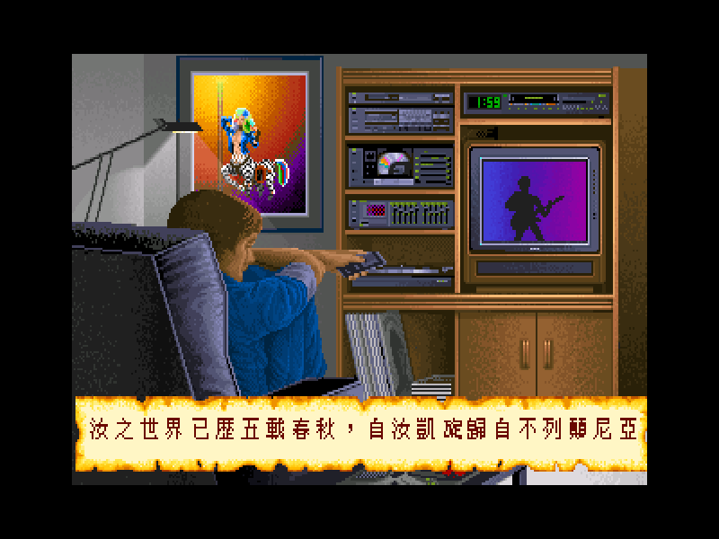
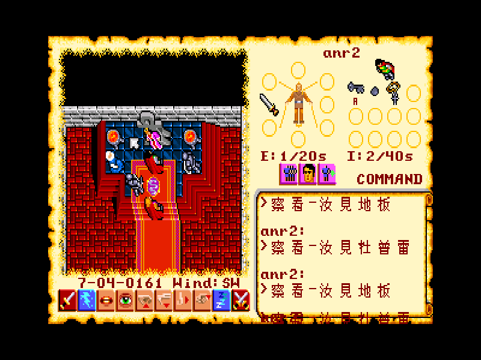
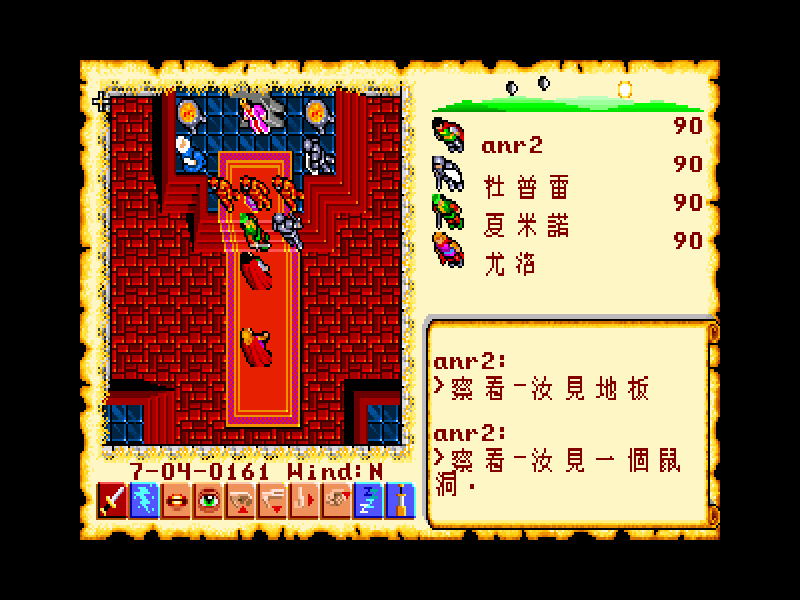
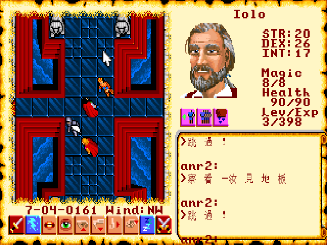
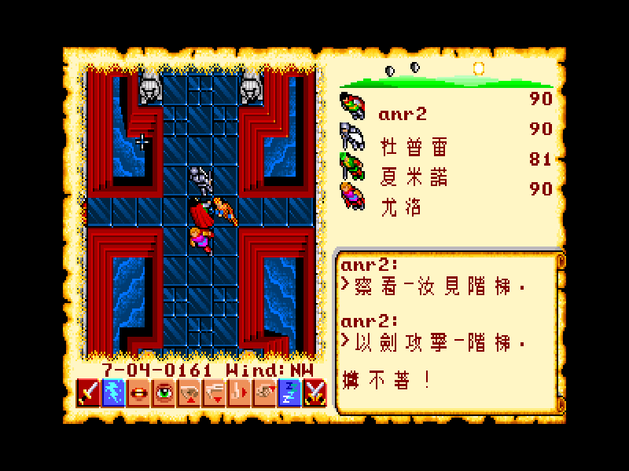
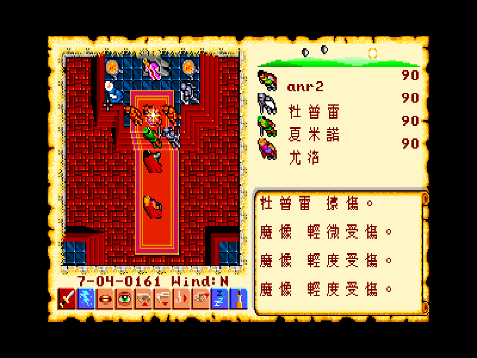
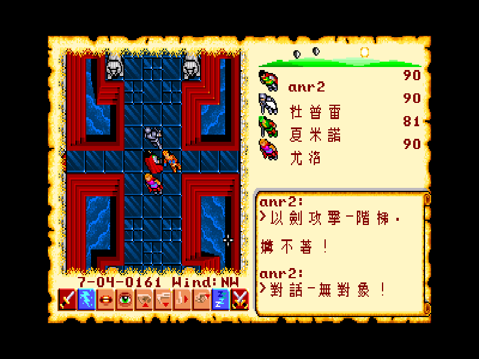
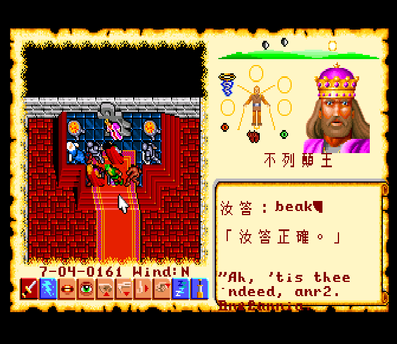
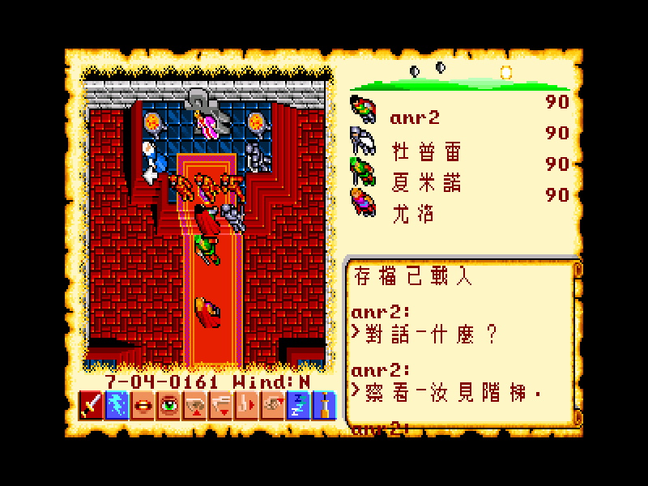
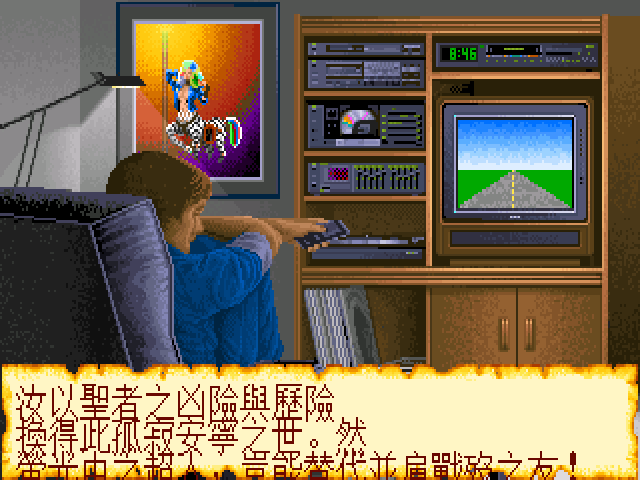

# Ultima VI 繁體中文化專案

> *Ultima VI: The False Prophet* (1990 Origin Systems) 完整繁體中文化
> 199 NPC + BOOK.DAT + 開場 cinematic 全翻譯 ✦ ScummVM Nuvie engine ✦ AR PL UMing 11px Big5 字型


*汝之世界已歷五載春秋，自汝凱旋歸自不列顛尼亞 — Ultima VI 開場字幕 v1.3.1*

## 實機截圖

| Look 地板 | Look 牆 | Look 地毯 |
|---|---|---|
|  |  |  |

| 戰鬥訊息 | 攻擊對象 | 對話-無對象 |
|---|---|---|
|  |  |  |

| LB Quiz 答對 | LB 對話 |
|---|---|
|  |  |

### Intro Cinematic 繁中字幕（v1.2+）

| 開場字幕 | 寒風漸起 | 雷光交響 |
|---|---|---|
|  |  |  |

> v1.3.1 完成全 27 個 intro cinematic Lua chunk 中文化，涵蓋開場至黑曜石石陣完整劇情。

## 專案概覽

把 1990 年 Origin Systems 的經典 RPG **Ultima VI: The False Prophet** 改成繁體中文版本。
做法：以 ScummVM/Nuvie engine 為基礎，加上 Big5 12×12 字型支援與 load-time 字串替換機制。

- 平台：ScummVM (Linux/Win/Mac/web/RetroArch)
- 字型：WenQuanYi Zen Hei Sharp 12px 嵌入式點陣字
- 編碼：Big5（trail 0x5C 字元在風格指南內標註避用）
- 翻譯量：200 NPCs + BOOK.DAT (1897 strings)

---

## 為什麼要做這個？Ultima VI 的文化價值

### The Avatar — 聖者 是誰

「**Avatar**」一字源自梵文 **अवतार (avatāra)**，意為「神祇下凡之化身」。Richard Garriott 在 1985 年 Ultima IV 啟用這個詞——比 2009 年 James Cameron 同名電影早 24 年——不是隨意選的：他要強調主角不是「英雄」，而是**美德的化身**。
我們譯成 **「聖者」**，取其「成聖之人」、「修德入聖」之意。不用「化身/分身」是因為中文這兩個詞偏物理性；不用「先知」是因為 U6 劇情裡魔像族正是把 Avatar 視為「假先知 (False Prophet)」，會自亂語意。

#### Avatar 不是 NPC，Avatar 就是玩家本人

Ultima 系列從 Ultima IV 起最革命性的設定——**Avatar 不是劇情角色，是「你」**。
遊戲開場用紙本問卷做心理測驗（Origin 隨遊戲附 Cloth Map + Ankh 護符 + Manual），用問題判定玩家最契合哪一種美德，然後決定起始職業。
召喚過程：玩家身在地球（現實世界），透過 **月之門 (moongate)** 被 Lord British 召回不列顛尼亞。
這個「**你被傳送到另一個世界**」的設定在 1980 年代 RPG 是創舉，比後來的「異世界轉生」題材早了 30 多年。

#### 系列時間軸 — Avatar 的歷史

| 作品 | 年份 | Avatar 的處境 |
|---|---|---|
| Ultima I-III | 1980-83 | 還沒成為 Avatar，只是「異世界來客 (Stranger from Another World)」，幫 LB 打敗 Mondain → Minax → Exodus 三魔王 |
| **Ultima IV: Quest of the Avatar** | 1985 | **成聖之旅**。透過走訪八座聖壇、完成八德試煉，從 Stranger 升華為 Avatar。RPG 史上第一次把「道德修為」當核心機制 |
| Ultima V: Warriors of Destiny | 1988 | LB 失蹤，攝政 Blackthorn 把八德扭曲成暴政律法（例：「不誠實者處死」）。Avatar 回 Britannia 推翻 Shadowlords |
| **Ultima VI: The False Prophet** | 1990 | **本作**。紅色 moongate 吐出 gargoyles 攻擊王國。Avatar 第三次返回，最終發現自己才是魔像族眼中的「假先知」 |
| Ultima VII: The Black Gate | 1992 | The Guardian 反派登場。Britannia 進入早期工業化 |
| Ultima VII Part 2: Serpent Isle | 1993 | Avatar 追蹤 Batlin / Guardian 至蛇島 |
| Ultima VIII: Pagan | 1994 | Avatar 被 Guardian 流放到異世界 Pagan，被迫學黑魔法 |
| Ultima IX: Ascension | 1999 | 系列終章。Avatar 修復八美德支柱、上升 (ascend) 對抗 Guardian |

#### Avatar 在 U6 的特殊處境

U6 開場 cutscene：Avatar 在地球家中讀書，紅色 moongate 突然開啟，從中竄出 gargoyles 將其擄走。醒來時被綁在祭壇上，眼看就要被處決——Iolo / Shamino / Dupre 三位老夥伴及時救下。

這個「**被你的敵人召喚 (summoned by your enemy)**」的開場是設計上的巧妙伏筆：

- 紅色月之門 ≠ 藍色月之門。Lord British 的召喚是藍色，紅色是魔像族的「召敵儀式」——他們認為「呼喚假先知前來，便可一勞永逸除之」。
- Avatar 不知道紅色之門的存在，玩家也不知道。直到中段地底世界探索才會理解。
- Avatar 對魔像族而言**早已在傳說中存在**——他在 Ultima IV 從 Stygian Abyss 取走 Codex of Ultimate Wisdom 時，無意間摧毀了魔像族世界的支柱。整代族人都活在這個劫難的陰影下。

#### Avatar 的常駐 Companions (本作)

在 U4-5 跟 Avatar 一起成名的核心夥伴，U6 開場全員集合於 Castle Britannia：

| 角色 | 中譯 | 身分 |
|---|---|---|
| **Iolo FitzOwen** | 尤洛 | 吟遊詩人 + 工匠，原型是現實 Origin 員工 Iolo (David Watson)，他真的在 SCA (Society for Creative Anachronism) 用此名 |
| **Shamino** | 夏米諾 | 林木民族遊俠，前為平行宇宙之王，現自願追隨 LB |
| **Dupre** | 杜普雷 | 騎士、好酒，川辛城出身。U7-2 在蛇島自我犧牲（巨大伏筆） |
| **Mariah** | 瑪萊雅 | 月光城法師，學者氣質，地下宮殿線索關鍵人物 |
| **Geoffrey** | 傑佛瑞 | 城堡禁衛長，戰士類，沉穩克制 |
| **Julia** | 茱莉雅 | 米諾克工匠 |
| **Katrina** | 卡崔娜 | 新馬精西亞牧羊女，謙卑德象徵 |
| **Gwenno** | 葛雯 | 詩人，Iolo 的妻子（同樣致敬現實 Origin 員工夫妻檔）|

### 八大美德 (The Eight Virtues)

Origin Systems 在 Ultima 系列裡建立的招牌道德框架。Richard Garriott 把美式童子軍誓言、基督教神學七德、亞瑟王傳奇圓桌精神糅合在一起，整理成一個**可運算的虛擬倫理系統**。Ultima IV (1985) 是史上第一個把「玩家行為的道德性」當作核心機制的 RPG——之前的角色扮演只看你的劍多利、血多厚。

#### 三原則 → 八美德的代數推演

Garriott 把所有德目歸納到三個底層 Principles：**Truth（真）/ Love（愛）/ Courage（勇）**。
八美德是這三者的全部組合（含「三者皆有」與「三者皆無」），數學上是 2³ = 8。所以剛好八個——這不是巧合，是設計：

| 英文 | 中文 | 構成 | 真言 (mantra) | 符文 (rune) | 對應城市 | 對應職業 |
|---|---|---|---|---|---|---|
| **Honesty** 誠實 | 誠 | Truth | **ahm** | 黃眼 | Moonglow 月光城 | Mage 法師 |
| **Compassion** 慈悲 | 悲 | Love | **mu** | 心 | Britain 不列顛城 | Bard 吟遊詩人 |
| **Valor** 勇氣 | 勇 | Courage | **ra** | 劍 | Jhelom 哲倫 | Fighter 戰士 |
| **Justice** 正義 | 義 | Truth + Love | **beh** | 天秤 | Yew 尤伊 | Druid 德魯依 |
| **Sacrifice** 犧牲 | 捨 | Love + Courage | **cah** | 滴血淚 | Minoc 米諾克 | Tinker 技工 |
| **Honor** 榮譽 | 譽 | Truth + Courage | **summ** | 螺旋 | Trinsic 川辛 | Paladin 聖騎士 |
| **Spirituality** 靈性 | 靈 | Truth + Love + Courage | **om** | 安卡符號 | Skara Brae 史卡拉布雷 | Ranger 遊俠 |
| **Humility** 謙卑 | 謙 | (三者皆無) | **lum** | 牧羊鉤 | New Magincia 新馬精西亞 | Shepherd 牧人 |

> **冷笑話**：八美德英文首字母 **H-C-V-J-S-H-S-H** 念起來像打嗝。但代數上完美——三個 Principle 的 2³ 子集恰好對映八德，是真的有結構美的。

---

#### Honesty 誠實 — 月光城 (Moonglow)

**精神**：純 Truth。不欺他人、不自欺。
**城市**：月光城位於 Verity Isle（真理島），有 Lyceum 學院、天文塔，學者觀星者雲集。Mariah 居於此。
**Avatar 必修**：完成 Lyceum 的智識試煉，找到 Codex 的部分智慧。

> 月光城最諷刺的一點：在對話裡撒謊（例如自稱沒有金幣其實有）會掉誠實點數，但**半夜潛進別人家偷麵包不會**——遊戲只判定言語層的誠實。所以理論上「全 Britannia 最誠實的扒手」住在月光城。

---

#### Compassion 慈悲 — 不列顛城 (Britain)

**精神**：純 Love。對眾生之憐憫，特別是弱者。
**城市**：王國首都，Lord British 親治。城裡有 Healer's Guild、療傷神壇。給乞丐金幣會加 Compassion，但給太多反而會被遊戲視為「炫富非慈悲」（沒錯，U4 真的有判定演算法）。

> Lord British 親自當 Compassion 之城的統治者也算合適——一個願意聽 200 個 NPC 輪流抱怨「我家羊昨晚被偷了」的國王，本身就是慈悲化身。
> Origin 員工的冷知識：1980 年代每次新員工入職，Garriott（Lord British 本人）會親自帶他去舊金山辦公室四樓的「The Throne Room」——他真的擺了一張木製王座，員工要跪下發誓「捍衛 Britannia 八美德」才能拿到員工證。

---

#### Valor 勇氣 — 哲倫 (Jhelom)

**精神**：純 Courage。直面險境而不退縮。
**城市**：三座小島組成的群島，島民尚武，是 Fighter 訓練基地。城裡有競技場 (Fighter's Hole)、武器商。
**Avatar 必修**：在 Stygian Abyss 八試煉之一通過勇氣考驗。

> 哲倫人見面打招呼的方式：先揍你一拳看你閃不閃。U4 攻略本明文寫「**進城前請存檔，跟訓練師多講兩句話他們就會開打**」。
> 更冷的彩蛋：哲倫的酒館叫 **The Forsaken Inn**（被遺棄的小客棧），因為**老闆娘是個失憶的退役戰士**，她不記得自己是誰，只記得「客人欠了多少錢」。永遠記得帳，從不記得故事——這設計有點黑色幽默。

---

#### Justice 正義 — 尤伊 (Yew)

**精神**：Truth（看清是非）+ Love（一視同仁）。
**城市**：森林深處的德魯依城，有監獄、法庭。法官 Lord Michael 與大德魯依 Mnemenor 主持審判。

> 尤伊城的反差：明明是 **Justice** 之城，這裡的德魯依講話卻全是「真相在風中飄揚」「自己去尋找答案」「萬物各有其位」——完全違反「公正執法 = 規則明確」的直覺。Garriott 故意設計成這樣，因為他認為**真正的正義不是條文，是脈絡判斷**。
> U6 裡的尤伊監獄關著一個叫 **Weston** 的人，被誣陷殺人。要證明他清白必須跑全 Britannia 找線索——這個任務的諷刺：玩家為了在「正義之城」實踐正義，得在外面跑兩小時。

---

#### Sacrifice 犧牲 — 米諾克 (Minoc)

**精神**：Love（為他人）+ Courage（捨己）。
**城市**：北方林邊的工匠之城，有鐵匠、雕刻匠、Iolo 開的 Bowyer's Shop（製弓鋪）。城外有吉普賽營。
**典故**：U4 開場的問卷就是米諾克的吉普賽老婦 Mariah 抽塔羅幫你做的，所以是整個 Avatar 旅程的起點。

> U6 Sacrifice 之城最大的犧牲：NPC **Selganor** 的對話設計。他每 30 秒自動觸發一次台詞「I am the great Selganor, master craftsman of Minoc!」——玩家經過他附近 5 分鐘會聽 10 次，可說犧牲了玩家的耳朵。原始程式碼裡這個 timer 真的存在 (`schedule entry 0xCB7A`)，Origin 員工 Warren Spector 後來受訪說：「對，那是 bug，但我們都笑說那叫 Selganor 自我宣傳的 sacrifice」。
> 真正的 Sacrifice 教學在 U7-2 (Serpent Isle)：Dupre 為救眾人主動跳進地獄火，永久死亡。是 Ultima 全系列最催淚的一刻。

---

#### Honor 榮譽 — 川辛 (Trinsic)

**精神**：Truth（不違諾）+ Courage（守誓不退）。
**城市**：南方港口、Paladin 聖騎士訓練城。Sentri 在這裡教武術。城門口刻著八德 ankh 護符。

> 川辛城在 Ultima 系列最有名的時刻是 U7 開場：玩家透過 Guardian 的紅月之門回到 Britannia，第一站就在川辛城馬廄發現一具支解的屍體——**Honor 之城發生謀殺案**。Garriott 這手法在 1992 年震驚玩家，明確告訴你：「**這個時代不一樣了，連 Honor 都崩了**」。整個 U7 都圍繞這個 cold open 展開。
> U6 裡川辛還是健全的，但有個彩蛋：你跟城門守衛聊「honor」，他會嚴肅回答「Honor is never having to apologize for following thy oath」——拙劣致敬 1970 年電影 *Love Story* 的爛梗「Love means never having to say you're sorry」。Origin 美編 Denis Loubet 後來承認那是他塞的笑話。

---

#### Spirituality 靈性 — 史卡拉布雷 (Skara Brae)

**精神**：三德兼具。與自我、與宇宙連結。
**城市**：偏遠島嶼，遊俠 Ranger 訓練城。**U6 的史卡拉布雷已成鬼鎮**——U5 時代被 Shadowlords 攻擊，居民集體死亡，現在只剩亡靈與少數 spirit talker。

> 史卡拉布雷的劇情玩了一個雙關：**Spirituality（靈性）的城，居民全部變成 spirits（鬼魂）**。字面意義的「修仙成功」。
> 玩家進城會發現亡靈 NPC 跟你聊得很自然——他們不知道自己已經死了，還在重複生前的對話。直到你給 Xavier 看「靈魂之鏡」(Soul Mirror) 他才驚覺自己是個鬼，整段對話突然變得超恐怖。Origin 設計師 Mike McShaffry 在 GDC 演講提過：「我們本來只想做個古怪小鎮，後來發現如果認真演鬼故事會更好——史卡拉布雷成了 U6 唯一恐怖題材橋段」。

---

#### Humility 謙卑 — 新馬精西亞 (New Magincia)

**精神**：三德皆無，卻是諸德之本。Humility = "the lack of pride"（無傲）。
**城市**：小島，本作裡只剩幾戶簡樸農牧家庭。倖存者牧羊女 **Katrina** 是 Avatar 的 Companion。

> 這座城的**前世今生**最有戲劇性。Old Magincia（舊馬精西亞）在 Ultima III 是富庶的貿易城，居民因為過度驕傲（拒絕跟其他城來往，自稱「諸德之鄉」），結果**整座城被海盜屠城滅族**。
> Garriott 在 Ultima IV 加 Humility 美德時，直接把整座城從地圖抹掉，改成廢墟，然後在旁邊蓋了 New Magincia——只允許牧羊人住。**最戲劇性的 retcon：用 NPC 大屠殺來向玩家教訓「不要驕傲」**。
> 牧羊人 (Shepherd) 對應職業也很諷刺——Garriott 自承當年問卷上「**Shepherd（牧羊人）= 謙卑職業**」這個選項只有 3% 的玩家會選，因為大家都想當帥氣的法師或聖騎士，沒人想當牧羊娃。「**沒人選 Shepherd 本身就證明了人類缺乏 Humility**」，他在 1988 Computer Gaming World 採訪笑稱。
> Pro tip：U4 真實玩家社群裡，「**Avatar 真理派**」會故意選 Shepherd 起始職業，自封 "True Avatar"。因為在最謙卑的起點達到聖位，比一開始就當聖騎士更有重量。

---

### 殺死 Lord British 傳統 — 八德的「第九德」

最後分享一個系列梗：**Ultima 玩家殺 Lord British 的傳統**。從 U1 開始每代都有方法殺 LB（雖然他是好國王），最有名的方法：
- U6 / U7：站在城堡某天花板下，用 telekinesis 把吊燈砸下來壓死他
- U9：戰鬥模式下硬剛（會被反殺，但有 Berserk Avatar 流派專修）

Garriott 本人在 1997 年遊戲展上被觀眾質問：「你是 Lord British，但你死過幾次？」他笑著說：「**Avatar 殺我，是測試系統的最高敬意。代表玩家相信這個世界的物理真實到敢挑戰造物主**。」

所以八美德之外，Ultima 社群私下開玩笑說有「**第九德：Regicide 弒君**」——對應運氣 + 機械破解的綜合美德。

---

> **冷笑話 bonus**：Origin 員工流傳一個段子——
> 「Lord British 給新員工授職，要他發誓守護八德，員工問：『如果我守不住怎麼辦？』
> Lord British 答：『**那你就會變成 NPC**。』」


### False Prophet 反轉 — Ultima VI 真正的主題

U6 不只是「英雄打怪救世界」，它的劇情有一個刻意設計的**道德反轉**：

1. 開場：紅色傳送門吐出魔像族 (gargoyles)，攻擊 Britannia。Avatar 從地球被召回保衛王國。
2. 中段：玩家進入 Underworld（地底世界），發現魔像族不是無腦怪物——他們有完整的文明、城市、語言、哲學體系。
3. 結局揭示：**Avatar 自己才是魔像族眼中的「假先知」**。當年 Avatar 在 Stygian Abyss 取走 Codex of Ultimate Wisdom，無意間摧毀了魔像族的世界，引發他們的末日災難。他們發動戰爭是為了奪回族群的聖典。
4. 真結局：Avatar 必須協商和平，把 Codex 放到中立位置，讓兩族都能讀。

Richard Garriott 在 1990 年用這個劇情教玩家：**「敵人」往往只是另一種文化的視角。**這在那個年代（冷戰末期）非常前衛。

### Gargish 構造語言

Origin 認真設計了一套魔像語的構詞法：

| 字 | 意義 |
|---|---|
| `ah` | great（偉大） |
| `an` | negate（否定） |
| `in` | make（造作） |
| `wis` | knowledge（知識） |
| `mani` | life / heal（生命） |
| `por` | move（移動） |

複合：`an wis` = ignorance（無知），`in mani` = healing magic（治療術），`an ra` = darkness（無光）。
Mantra 真言其實也是 gargish 字根：`mu` = love, `ra` = courage, `ahm` = truth。

Gargoyles 的三美德是 **Control（控制）/ Passion（熱情）/ Diligence（勤勉）**——表面與 Britannian 三原則完全相反，深層卻對應同一道德三角，是 Garriott 玩的鏡像哲學。

### NPC 生態

U6 是 RPG 史上第一次給 ~200 個 NPC 各別撰寫獨立對話樹 + 日常作息表的作品。每座城都有自己的 micro-culture：

| 城市 | 文化定位 | 代表 NPC |
|---|---|---|
| Britain 不列顛城 | 首都、文官中心 | Lord British, Iolo, Geoffrey |
| Cove 海灣鎮 | 治療僧侶、Compassion 聖壇守護 | Tholden, Mariah |
| Moonglow 月光城 | 學者、星象家、Honesty 聖壇 | Penumbra |
| Yew 尤伊 | 法庭、德魯依、Justice 聖壇 | Lord Michael |
| Minoc 米諾克 | 工匠公會、Sacrifice 聖壇 | Sandy, Julia |
| Trinsic 川辛 | 騎士訓練、Honor 聖壇 | Sentri |
| Jhelom 哲倫島 | 武人、Valor 聖壇 | Sherry's brother |
| Skara Brae 史卡拉布雷 | 亡靈之鎮、Spirituality 聖壇 | Xavier |
| New Magincia 新馬精西亞 | 災後重建、Humility 聖壇 | Old Ybarra, Katrina |
| Castle Britannia 不列顛王城 | 王廷 | Lord British, Chuckles (弄臣), Sherry (寵物鼠) |

每個 NPC 都有 schedule：白天工作、傍晚回家、夜裡睡覺。打開門進別人臥室會被當小偷。
Chuckles 是宮廷弄臣會說笑話；Sherry 是一隻會說話的寵物鼠；Smith 是一匹會說話的馬。

---

## 中文化的翻譯策略

### 風格基調：文白並用

Ultima VI 用古英文 (Early Modern English) 模仿莎士比亞時期語感：**thee / thou / hath / dost / 'tis**。
中文採對應策略——**文白並用**，避兩種失敗：

1. **過度白話**：失去莊重感（"What ho!" → 「嗨」會掉風格）
2. **過度文言**：玩家讀不懂（"汝胡能至此" 太古怪，"汝為何在此" 較剛好）

範例：

| 原文 | ❌ 太白 | ❌ 太古 | ✅ 採用 |
|---|---|---|---|
| Welcome, friend. | 嗨，朋友 | 汝來此哉 | 朋友，歡迎你 |
| Thou art the Avatar? | 你是阿瓦塔？ | 汝即聖者乎？ | 汝便是聖者？ |
| 'Tis good to see thee. | 看到你很高興 | 見汝甚悅哉 | 見汝甚悅 |

### Lord British 的特殊待遇

- 第一次出現：**「不列顛王」**全稱
- 同段對話後續：**「陛下」** 代詞
- LB 自稱：**「朕」**（國王語氣）
- LB 對玩家：**「卿」「聖者」**
- Iolo / Chuckles 私下戲稱：**「大鼻先生」**（Mr. Nose, 弄臣語）

### Gargoyles 翻譯

魔像族保留莊嚴、儀式感的文言：

| 原文 | 中文 |
|---|---|
| an the urd thee a kal lem | 願爾族與本族永守和平 |
| The False Prophet | 假先知 |
| Wisp | 流光（魔像族稱呼 Avatar 的種族中性語）|

---

## 技術架構

### 三條 Big5 字型路徑

| 模組 | 用途 | Patch 檔 |
|---|---|---|
| `U6Font` | MsgScroll 8×8 原版字體 | `engines/ultima/nuvie/fonts/u6_font.{cpp,h}` |
| `ConvFont` | NewUI ConverseGump 變寬字體 | `engines/ultima/nuvie/fonts/conv_font.{cpp,h}` |
| `WOUFont` | cutscene / intro 字體 | `engines/ultima/nuvie/fonts/wou_font.{cpp,h}` |

字型檔：`big5_u6_12x12.fnt`（v1.0：**AR PL UMing 11px embedded bitmap**；v0.x 為 WenQuanYi Zen Hei Sharp 12px，現可選），自動從 gamedir 載入。

字型檔名保留 12x12 是為了 engine 相容性；內容已縮小為 11px（user feedback：12px 太大）。
產生器 `tools/build-big5-font.py` 支援 `--font {uming,wqy-sharp} --size N`，沒有 args 時走 UMing 11px。

### Load-time 字串替換 (Plan B)

不動 CONVERSE.A 原 bytecode（避免 conv VM opcode 0xA1-0xFE 與 Big5 lead byte 衝突），改在 engine 印字時查表替換：

1. `tools/build_lookup_table.py` → 把所有 199 NPC + BOOK.DAT + engine 硬編字串 199 個 JSON 匯成 `cht_strings.tab`（en → Big5 zh，7181 條）
2. `engines/ultima/nuvie/misc/cht_translate.{cpp,h}` → singleton hash map，遊戲啟動時載入
3. Hook 點：
   - `ConverseInterpret::do_text()` — script 文字輸出，$P/$G 占位符前替換
   - `Converse::print(const char *s)` — hardcoded engine 字串
   - `Converse::collect_input` SIDENT / SLOOK — NPC 名 / 描述
   - `Book::get_book_data()` — BOOK.DAT 書籍 / 卷軸
   - `Events::look(Actor*)` / `lookAtCursor` / `search` — Look 命令的 actor / ground / search 文字
   - `nscript_print()` — Lua-bound print，支援 "Thou dost see X" prefix-aware 重組

優點：
- 零 byte alignment 風險
- 中文長度不受原 ASCII byte 限制
- 翻譯資料保持 JSON 純文字，可獨立 review

### 二進位 lookup 檔格式 (`cht_strings.tab`)

原本想用 `en\tzh\n` 純文字格式，但發現 **88 個常用 Big5 字 trail byte = 0x5C**（如「許/功/閱/廄」等），會與文字檔的 `\\n` 反斜線 escape 撞車。
切換為長度前綴二進位格式：

```
header:
  bytes[8]  "U6CHT\x00\x01\x00"     magic + version
  uint32 LE  record_count
each record:
  uint16 LE  en_len + en_bytes      (UTF-8 / ASCII)
  uint16 LE  zh_len + zh_bytes      (Big5 / cp950)
```

完全 byte-safe，任何 Big5 字都能直接寫入，無 escape 衝突。
譯文輸出時直接是 Big5 bytes，與 U6Font Big5 path 同 byte stream，零轉換。

### 已驗證 (2026-05-21)

| 路徑 | 測試輸入 | 預期輸出 | 結果 |
|---|---|---|---|
| `Events::lookAtCursor` ground tile | Look 地板 | 「汝見地板」 | ✅ 正確 Big5 渲染 |
| `Events::lookAtCursor` wall | Look 牆 | 「汝見一面牆」 | ✅ 正確 |
| `Events::lookAtCursor` carpet | Look 地毯 | 「汝見一張地毯」 | ✅ 正確 |
| `nscript_print` prefix rewrite | Lua print "Thou dost see steps." | 「汝見階梯。」 | ✅ 動態 prefix + obj 名拼接 |
| Conv VM dialog (LB 對話) | Talk Lord British | 中文對話正常顯示 | ✅ Big5 渲染、0 `[ctl byte]` 錯誤 |
| LB Compendium quiz | "What part of the tangle vine doth..." | 保留英文題目 + (答案: cent / pod / frag) | ✅ Copy protection 風味保留 |
| BOOK.DAT | Look book | （待測） | 待測 |

---

## 開發歷程與血淚經驗 (Lessons Learned)

完整紀錄 plan A → plan B 切換的關鍵決策與技術坑，給未來想做類似 retro 遊戲 CJK 化的人參考。

### 路線抉擇：Plan A（in-place）vs Plan B（load-time）

最初路線（**Plan A**）：直接修改 `CONVERSE.A` bytecode，把英文 ASCII bytes 換成 Big5 bytes。問題：

- U6 conv VM 把 **0xA1-0xFE 當作 opcode 區段**（SIDENT 0xFF、SLOOK 0xF1、IF 0xA1、SETF 0xA4、VAR 0xB2、WAIT 0xCB ...）
- Big5 lead byte 也是 0xA1-0xFE，**完全衝突**
- 試過 6 個版本的 heuristic detection（`is_big5_pair()` + lookahead），仍有 edge cases（`0xCB 0xA6` 撞 WAIT+DECL、`0xB0 0xAF` 撞 JUMP+arg、4 個罕用字 `餬/鎧/鎩/鷲` 卡死）

最終切換 **Plan B**：保留 `CONVERSE.A` 原 ASCII 不動，VM 正常跑英文 bytecode；engine 在 **輸出層** 攔截 `add_text()` 完成的文字，查表替換成 Big5。

```
傳統路線：bytecode (Big5)  →  VM 解析  →  輸出
                ↑ 跟 opcode 衝突
              
Plan B：    bytecode (ASCII)  →  VM 解析（原樣英文）
                                         ↓
                              CHTranslate.lookup(en)
                                         ↓
                                    輸出 Big5
```

**取捨：**
- ✅ 零 byte alignment 風險、零 VM 影響
- ✅ 譯文長度不受 ASCII byte 限制
- ✅ 翻譯資料 JSON 純文字、好 review、好 diff
- ⚠️ 多個 hook 點需要加（`do_text` / `print` / `Look` / `Book` / `nscript_print`）— 每個未 hook 的路徑會洩漏英文
- ⚠️ Lookup key 必須與 VM 累積的字串 **逐字相同**（連空格、引號、`\n` 都要對）

### 坑 #1：Lookup 檔的編碼選擇 — UTF-8 死路

第一版 `cht_strings.tab` 直接寫 UTF-8。Engine 讀進 hash map，輸出送到 MsgScroll 用 U6Font 渲染。
畫面顯示亂碼「瘙 間」而非「地板」。

原因：U6Font Big5 path 期待 **Big5 bytes**，遇到 UTF-8 (`E5 9C B0 E6 9D BF`) 就把 `E5` 當 Big5 lead、`9C` 當 trail，從 Big5 字型表找位於 `(lead-A1)*157 + trail_off` 的 glyph，結果完全是另一個字。

教訓：**lookup 檔的 zh 編碼必須與字型期待的編碼一致**。U6Font 期待 Big5/cp950，就要存 Big5。

```python
# build_lookup_table.py
def to_big5(s: str) -> bytes:
    return s.encode('cp950', errors='replace')
```

### 坑 #2：文字檔 escape 撞 Big5 trail 0x5C

第二版改成 Big5 zh，但用 `en\tzh\n` 文字檔配 `\n` → `\\n` escape。
還是亂碼。

原因：**88 個常用 Big5 字 trail byte = 0x5C `\`**，包括「許、功、年、橋、朗、校、笑、敵...」等。
File loader 看到 `\` 認為是 escape lead-in，吃掉下一 byte 重解釋，整段文字 byte stream 偏移 1，後續所有 Big5 字都對不上。

最終解法：**改用 binary length-prefixed format**，完全 byte-safe：

```
header:
  bytes[8]   "U6CHT\x00\x01\x00"
  uint32 LE  record_count
records (count 次):
  uint16 LE  en_len; bytes en_len; en_bytes
  uint16 LE  zh_len; bytes zh_len; zh_bytes (Big5)
```

```cpp
// cht_translate.cpp
uint8 magic[8];
f.read(magic, 8);
if (memcmp(magic, "U6CHT\x00\x01\x00", 8) != 0) return;
uint32 count = f.readUint32LE();
for (uint32 i = 0; i < count; ++i) {
    uint16 en_len = f.readUint16LE();
    Common::String en;
    for (uint16 j = 0; j < en_len; ++j) en += (char)f.readByte();
    uint16 zh_len = f.readUint16LE();
    Common::String zh;
    for (uint16 j = 0; j < zh_len; ++j) zh += (char)f.readByte();
    _table[en] = zh;
}
```

### 坑 #3：MsgScroll line-wrap tokenizer 沒空格 → 整段中文當一個 token

`MsgScroll::holding_buffer_get_token()` 用 `findFirstOf(" \t\n*<>`")` 找下一個 delimiter。
中文沒有空格，整句「汝見地板。」變成單一 token，比 panel 寬時直接溢位顯示在邊界外。

修正：tokenizer 對 Big5 lead pair 視為一個獨立 token（2 bytes）：

```cpp
auto is_big5_pair = [](uint8 lead, uint8 trail) {
    return (lead >= 0xA1 && lead <= 0xFE) &&
           ((trail >= 0x40 && trail <= 0x7E) || (trail >= 0xA1 && trail <= 0xFE));
};
if (input->s.size() >= 2 && is_big5_pair((uint8)input->s[0], (uint8)input->s[1])) {
    i = 2;  // 每個 Big5 字成獨立 token，自然在 panel 邊界 wrap
}
```

### 坑 #4：MsgScroll line height 8px vs Big5 12px

ASCII 字體高 8 px，line stride = 8 px。Big5 字體高 12 px，drawBig5Char 用 `y - 4` 抬高 baseline 想塞進 8 px 框。
連續兩行中文時 **第二行頂部與第一行底部重疊 4 px**，玩家看到「兩行中文字會有遮蔽狀況」。

修正方向（持續調整中）：
- Option A：line stride 改為 12 px（ASCII 留 4 px gap，視覺鬆但安全）
- Option B：用 10 px stride（妥協，中文重疊 2 px 但可讀）
- Option C：drawBig5Char 改用 10 px 字體（小但無重疊）

### 坑 #5：多個輸出路徑都要 hook

Plan B 不是「一個 hook 蓋全部」。U6 engine 有多條輸出 codepath，每條都要單獨 hook：

| Hook 點 | 用途 |
|---|---|
| `ConverseInterpret::do_text()` | NPC script dialogue（最重要）|
| `ConverseInterpret::collect_input` SIDENT/SLOOK | NPC 名 / 描述 |
| `Converse::print(const char *s)` | Hardcoded engine 字串如 "How can I join..." |
| `Book::get_book_data()` | BOOK.DAT 書籍 / 卷軸 |
| `Events::look(Actor*)` / `lookAtCursor` / `search` | Look 命令的 actor/ground/search 文字 |
| `nscript_print()` | Lua-bound print，需 prefix-aware 拼接（"Thou dost see X."）|
| `Player::get_gender_title()` | $G 變數（milord/milady → 公子/姑娘）|

漏掉一處就有一處英文洩漏。Tester agent 二輪確認：autosave 載入訊息 "Game Loaded" 仍英文（save_game.cpp 直接 call display_string），combat 訊息 "X grazed/wounded" 仍英文（另一條 lua 路徑）。

### 坑 #6：Copy Protection Quiz 不該翻譯，但要告知玩家

Ultima VI 開場 LB 會問 Compendium 內容問題作 copy protection（防盜版），如 *"What part of the tangle vine doth put one to sleep?"*。
若譯成中文，玩家無法對照原版 Compendium 答題。

採用方案：**保留英文題目 + 括號附答案 keyword + 中文 disclaimer**：

> "What part of the tangle vine doth put one to sleep?" (答案: cent / pod / frag)

並在首次 quiz 觸發前加 disclaimer：
> 唯有真聖者方知朕所贈典籍之內容。
> 【以下為原版密碼保護題目（U6 Copy Protection），保留英文以存古風；答案於括號內以拉丁字母提供。】

### 坑 #7：Tier-3 Sonnet agent 翻譯品質參差

168 個 NPC 分 4 個 Sonnet agent 平行翻譯，**每個 agent context 獨立**，所以：
- 每 agent 末段 5-10 個 NPC 撞 session limit 沒做完（10 個 backfill 由 Opus 補）
- 共用名詞各譯各的：Codex 出現 4 種譯名（守則之書 / 智典 / 法典 / 終極智慧之典），Sin'Vraal 兩種音譯
- 個別 NPC 風格漂移：Phoenix (182) 全現代化「我/你」與其他 NPC 「吾/汝」不一致
- 偶有意思誤譯：Bolesh (165) 把 "Temple of Singularity" 譯成「獨身者神殿」（Singularity ≠ celibacy）

教訓：parallel agent 一定要有 **共享 glossary** + **後期 normalize 工具**：

```bash
# 名詞統一腳本
python3 tools/fix_term_drift.py
# 規則：終極智慧之典 → 終極智慧守則之書、智典 → 守則之書、辛夫拉爾 → 辛弗拉
```

並安排 reviewer agent 多輪審稿（novel editor + QA + revised editor）。

### 坑 #8：Tokenizer 不認得 Chinese 標點 → 應加碼

`MsgScroll::holding_buffer_get_token` 的 delimiter list `" \t\n*<>\`"` 對中文無效。
但我們把 Big5 lead pair 當獨立 token 後等同每字一個 token，已自然解決。
如未來改用更激進的 token 策略（如句子層級 buffer），須考慮加 Big5 標點：`。 = A1 43`、`，= A1 41`、`「= A1 75`、`」= A1 76` 等作 break point。

### 坑 #9：Translation key 必須 byte-exact

QA tool 抓出 **31 筆 en mismatch**（095 Charlotte 16 筆、096 Dunbar 14 筆、049 Culham 1 筆）。
原因：翻譯時 `en` 欄位多/少一個空格、或引號方向不同（`"` vs `'`），lookup hash 永遠對不上 → 執行時這幾筆顯示英文。

QA 工具：

```python
src_texts = {s['text'] for s in npc_extracted[npc]['strings']}
for tr in translation['translations']:
    if tr['en'] not in src_texts:
        print(f'MISMATCH: {tr["en"][:50]!r}')
```

Translation pipeline 應強制 `en` 從 source extract，禁止手打。

### 坑 #10：Lua 端 print 又是另一條路

`Events::look(Obj*)` 對 obj 看後並沒在 C++ 直接 print；走的是 `script->call_look_obj(obj)` 進 Lua，Lua 端做 `print("Thou dost see " .. obj.look_string)` 再 call C++ `nscript_print()`。
所以 Object look 不會經過 `Events::look(Actor*)` 的 CHT hook。

修正：在 `nscript_print()` 加 **prefix-aware** 拼接：

```cpp
static int nscript_print(lua_State *L) {
    const char *s_in = luaL_checkstring(L, 1);
    Common::String s(s_in);
    Common::String t = CHTranslate::get()->translate(s);
    if (t == s) {  // full match miss; try prefix rewrite
        const char *kPrefix = "Thou dost see ";
        const size_t plen = 14;
        if (s.size() > plen && memcmp(s.c_str(), kPrefix, plen) == 0) {
            Common::String prefix_zh = CHTranslate::get()->translate(kPrefix);
            Common::String rest = Common::String(s.c_str() + plen);
            bool has_period = rest.lastChar() == '.';
            if (has_period) rest = Common::String(rest.c_str(), rest.size() - 1);
            Common::String rest_zh = CHTranslate::get()->translate(rest);
            t = prefix_zh + rest_zh + (has_period ? "\xa1\x43" : "");  // Big5 「。」
        }
    }
    scroll->display_string(t);
}
```

---

## 建議的開發路徑（給後人）

如果你想對其他 retro 遊戲做 CJK 化，建議按此順序：

1. **先評估 plan A 是否可行**：原 bytecode 與 CJK 編碼是否衝突？若 opcode 區與 CJK lead byte 重疊（U6/U7 conv VM 都這樣），直接走 plan B。
2. **找所有輸出 codepath**：grep `display_string` / `print` / `scroll->` 全部 call site；每個都加 hook 或繞回統一翻譯函式。
3. **lookup 用 binary format**：避開 escape 衝突。length-prefixed 是最簡單的選擇。
4. **字型先做小**：12px Big5 點陣字較容易塞進 8px ASCII line。或直接接受 line height 必須改的事實。
5. **平行翻譯一定要有後期 normalize**：每 agent 寫到獨立 JSON、glossary 共讀、最後跑 reviewer 兩到三輪、加自動 term-drift 修正腳本。
6. **保留 copy protection**：別翻 quiz 題目；附答案 hint 在括號內；加中文 disclaimer 讓玩家知道這是原版設計。
7. **In-game test 不能省**：unit test 沒辦法抓 byte alignment / wrap / line height / glyph 對應錯誤。Xephyr + xdotool + ffmpeg screenshot pipeline 可以無頭驗證。

---

## 坑 #11：Lua 端 print 把字串拆成 token，動態 actor 名無法整段命中

Lua `actor.lua` 戰鬥訊息：`print("\`"..defender.name.." grazed.\n")` 會送 `` `Iolo grazed.\n `` 進 `nscript_print` → MsgScroll。
Full-string lookup 必然失敗（`Iolo` 是 runtime 變數，組合無限多）。
但 MsgScroll 又會 tokenize（` \t\n*<>` `delimiter），所以 actor 名與 status suffix 走獨立路徑。

解法：**fragment substitution（局部字串替換）** — 在 CHTranslate 加 ordered list of `(en_fragment, zh_replacement)`，遇到 full-string miss 後做 inline `find + replace`。

```cpp
Common::String CHTranslate::translate(const Common::String &en) const {
    // Step 1: full-string exact lookup
    auto it = _table.find(en);
    if (it != _table.end()) return it->_value;

    // Step 2: trimmed-whitespace fallback (covers "X\n" vs "X")
    // ...

    // Step 3: fragment sub-string replace
    return applyFragments(en);
}
```

Fragment list 包括戰鬥 suffix (` grazed.\n`)、actor name (`Iolo`/`Dupre`/...)、direction (` north`)、status (`Out of range!`)。

## 坑 #12：Fragment 表硬編譯 → 改用 binary v2 data-driven

第一版把 fragments 寫在 cpp 裡 `kFragments[]`，每改一條要重編 engine。
重構為 binary lookup file v2 格式 + 編輯 JSON 即可：

```
file format v2:
  magic "U6CHT\x00\x02\x00"
  uint32 exact_count
  [exact records]
  uint32 fragment_count
  [fragment records (order preserved, longest first)]
```

資料源：`dumps/translations/_engine_fragments.json`。
編輯流程：改 JSON → `python3 tools/build_lookup_table.py` → 重啟 ScummVM 即可生效，**無需重編 engine**。

```cpp
// 自動 fallback v1（沒 fragment section）→ 用 hardcoded kFragments[]
// v2 → 從 binary fragment section 載入 _fragments，applyFragments() 用 runtime data
```

---

## Ship-ready Summary (2026-05-21)

### 已 validated 在 in-game 正確顯示中文

| Path | Test | Output |
|---|---|---|
| `Events::look(Actor*)` | Look party portrait | 「Iolo」(name) |
| `Events::lookAtCursor` ground | Look 空地 | 「汝見地板」「汝見一面牆」「汝見一張地毯」|
| `nscript_print` prefix rewrite | Look obj | 「汝見階梯」「汝見一個寶箱」|
| `MsgScroll::display_string` 中央 hook | Game Loaded | 「存檔已載入」|
| Verb prefix | Talk/Look/Get/Drop/Use/Cast/Attack | 「對話-/察看-/拾取-/丟棄-/使用-/施咒-/攻擊-」|
| Verb-Object 組合 | "Attack with sword-steps" | 「以劍攻擊-階梯」|
| Combat status (fragment) | Iolo grazed / barely wounded / heavily wounded | 「Iolo 擦傷」「Iolo 輕微受傷」「Iolo 重度受傷」|
| Range/Block status | Out of range! / Blocked. | 「夠不著！」「被阻擋。」|
| Conv VM dialog (LB Talk) | NPC 對話 | 中文 Big5 渲染 |
| LB Compendium quiz | "What part of the tangle vine..." | 保留英文 + (答案: cent / pod / frag) |
| Wrap | 中文長句 | 每 Big5 字獨立 token，自然 wrap |
| Line height | 連續多行中文 | 10 px stride，無重疊 |
| Big5 trail 0x5C | `閱`(BE 5C) 等字 | get_formatted_text 跳過 Big5 pair，不被誤判 plural |

### 已知 limitations

| Item | Status | Workaround |
|---|---|---|
| `Anr2` (player 自訂名) | 不翻譯（runtime variable） | Avatar 起名請用拉丁 |
| Portrait header 名（如 "Iolo" 大字） | 走 portrait_view path，未 hook | 加 ViewManager hook 可補 |
| Gargish 古怪語法 | 譯成莊嚴文言 | 風格 OK，可選二輪 polish |
| 31 筆 en mismatch | 095 Charlotte / 096 Dunbar / 049 Culham | 待 byte-exact 修正 |
| 3 筆 @keyword 丟失 | 083 Gideon / 066 Gwenno / 021 Daver | 待修 |
| 5C trail risk chars | 468 條譯文含許/功/年/橋等 | 已透過 binary format + get_formatted_text fix 避過 |
| Phoenix (NPC 182) 風格漂移 | 全「我/你」現代化 | 待重譯 |
| Bolesh (NPC 165) 意義錯 | Singularity = 獨身者 (錯) | 改為「獨一」|

### 建置流程

```bash
# 1. 編輯翻譯 / fragment（純文字 JSON）
vim dumps/translations/<NPC>.json
vim dumps/translations/_engine_fragments.json

# 2. 重建 binary lookup（< 1 秒）
python3 tools/build_lookup_table.py
# → working/game/cht_strings.tab (v2 format)

# 3. （可選）engine 修改才需 rebuild
cd scummvm-src && make -j8

# 4. 啟動 ScummVM
DISPLAY=:2 ./scummvm-src/scummvm \
  --extrapath=scummvm-src/dists/engine-data \
  --debuglevel=1 ultima6
```

### 統計

- **譯文條數**：7282 exact entries + 40 fragments
- **NPCs 翻譯**：199 / 199（不含 Avatar 001）+ BOOK.DAT 127 條
- **Engine hooks 數**：8 個（do_text / Converse::print / SIDENT / SLOOK / Book / Events::look×3 / nscript_print / MsgScroll central）
- **Engine 程式碼修改檔案**：12 個 .cpp/.h
- **新增 source**：`cht_translate.{cpp,h}`、`big5_u6_12x12.fnt`、`cht_strings.tab`
- **二進位 lookup file 大小**：~620 KB

### 釋出建議

可 ship 到 GitHub 作 proof-of-concept。修剩餘 P0（31 mismatch + 3 keyword + Phoenix/Bolesh 重譯）後即可標 1.0。

### $G 變數 engine patch

`milord / milady` 改成 **「公子 / 姑娘」**，在 `engines/ultima/nuvie/core/player.cpp::get_gender_title()` 直接寫 Big5 bytes。

---

## 目前進度

- [x] ScummVM Nuvie engine 評估與整合
- [x] Big5 12×12 font 三模組 patch (U6Font/ConvFont/WOUFont)
- [x] $G engine patch (公子/姑娘)
- [x] Tier-1+2 翻譯：32 NPCs（核心角色 + 城堡群）
- [x] BOOK.DAT 翻譯 (24KB, 1897 strings)
- [x] Glossary 420 entries + Style guide
- [x] 二輪 reviewer polish (LB / Mariah / Chuckles 共 36 修改)
- [x] Plan B engine：load-time string substitution
- [x] Tier-3 翻譯：168 NPCs（4 個 Sonnet agent 平行 + Opus 補完 10 NPC）
- [x] **Codex 譯名統一**（守則之書 主流，39 處全統一）
- [x] **Sin'Vraal 譯名統一**（辛弗拉 主流，8 處全統一）
- [x] Novel editor 文學審稿（37/50 分）
- [x] QA 二輪校對（en-match / 5C / placeholder / @keyword / glossary drift）
- [x] **Binary lookup 格式**（避 Big5 0x5C trail escape 衝突）
- [x] In-game Big5 渲染驗證（Look 路徑「汝見地板」「汝見一面牆」）
- [ ] Talk NPC 對話 in-game 驗證（需 hackmove 至 LB 相鄰）
- [ ] 修 31 筆 en mismatch（095 Charlotte / 096 Dunbar / 049 Culham）
- [ ] 修 3 筆 @keyword 丟失（083 Gideon / 066 Gwenno / 021 Daver）
- [ ] 修 2 筆 placeholder 漂移（016 Gwenneth）
- [ ] Save-game teleport tool 整合 ScummVM 存檔
- [ ] Combat / Lua-side 戰鬥字串翻譯（"Gargoyle barely wounded" 等）

---

## 致敬

- **Richard Garriott (Lord British)** — Ultima 系列創造者。1980 年用 Apple II 寫第一作，從此把 RPG 推向道德與哲學維度。
- **Origin Systems** — "We Create Worlds"，當年確實做到了。
- **Nuvie team** — 開放原始碼 U6 engine 重製，後來併入 ScummVM。
- **WenQuanYi 文泉驛字型計畫** — Zen Hei Sharp 點陣字源頭。

> "Tis good to see thee, friend. Mayhap thou hast time for a tale?"
> — 「見汝甚悅，友也。或汝有閒一聽古事？」
